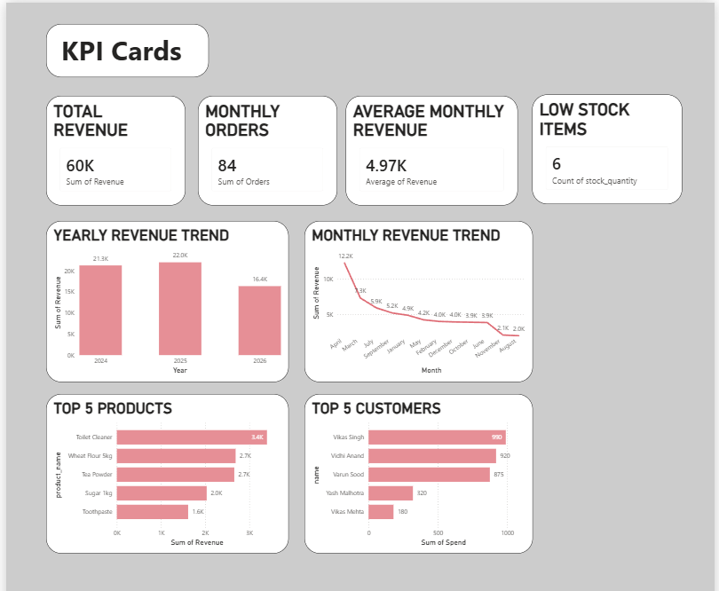
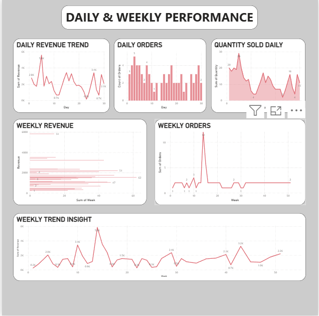
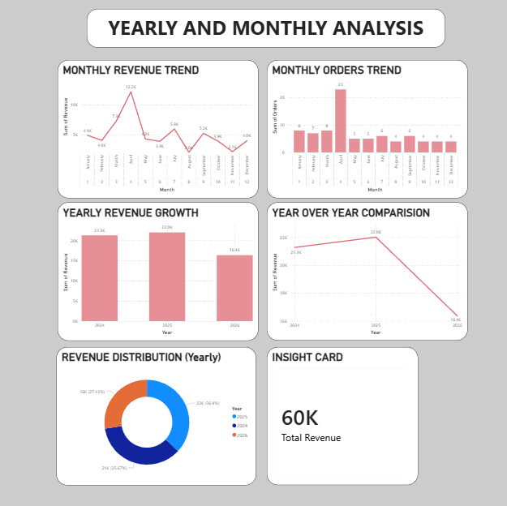
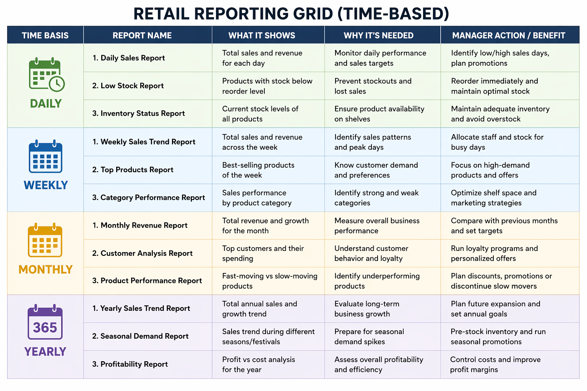
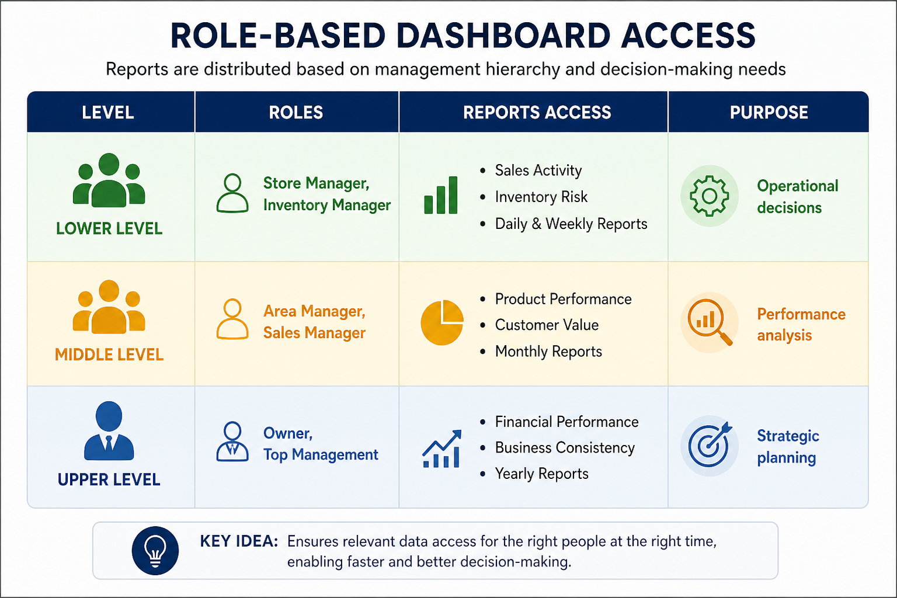
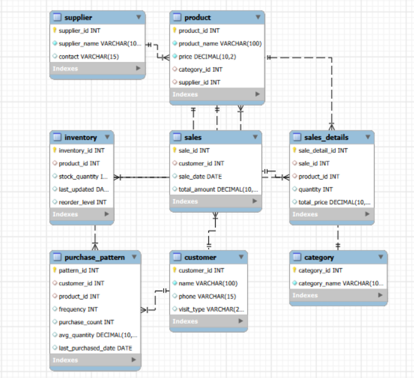

# Retail Analytics & Stock Optimization System


## Project Overview

This project demonstrates how Business Analytics can improve retail operations by integrating SQL, Python, and Power BI into a single data-driven solution.

The system enables sales analysis, inventory monitoring, customer insights, and interactive dashboard reporting to support faster and more informed business decisions.

---

## Problem Statement

Retail businesses often face challenges such as:

- Overstocking and stock shortages
- Lack of real-time inventory visibility
- Manual reporting processes
- Limited understanding of sales trends
- Inefficient decision-making

This project addresses these challenges through an end-to-end analytics solution.

---

## Tech Stack

- SQL
- Python
- Pandas
- NumPy
- Matplotlib
- Power BI
- Microsoft Excel

---

## Project Structure

```text
Retail-Analytics-and-Stock-Optimization-System
│
├── dashboard
├── documentation
├── images
├── presentation
├── python
└── sql
```

---

## Dashboard Preview

### Dashboard Overview



---

### Daily & Weekly Analysis



---

### Monthly & Yearly Analysis



---

### Retail Reporting Grid



---

### Role-Based Dashboard Access



---

## 🗄️ Database Design

The database follows a relational model consisting of:

- Customer
- Product
- Sales
- Inventory
- Sales Details

These tables are connected using primary and foreign keys to ensure data integrity and efficient querying.

### ER Diagram



---

## Key Business Insights:

- Identified top-performing products contributing the highest revenue.
- Detected products approaching reorder levels.
- Analyzed weekly and monthly sales trends.
- Evaluated customer purchasing behaviour.
- Generated actionable insights for inventory optimization.

---

## Future Improvements

- Machine Learning based Sales Forecasting
- Demand Prediction
- Customer Segmentation
- Automated Inventory Alerts
- Predictive Analytics Dashboard

---

## Author

**Diksha Pandey**

GitHub:
https://github.com/databydiksha

---
